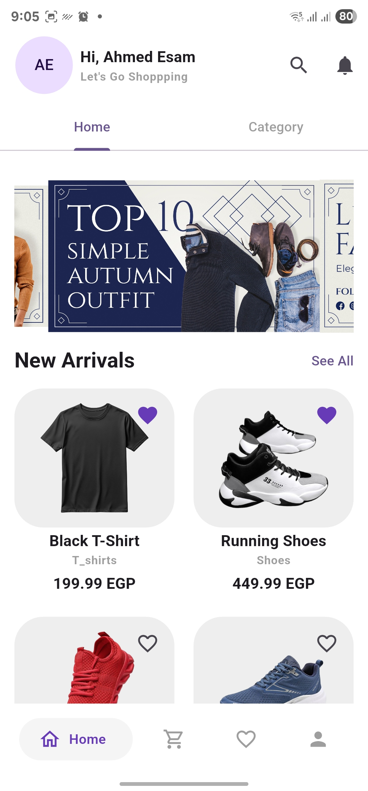

# 🛍️ Flutter E-Commerce App

This is a fully functional e-commerce mobile app built with Flutter and Firebase.  
It includes product browsing, user authentication, cart and favorites management, all powered by Firestore.

---

## 🚀 Features

- User Authentication (Login / Sign Up / Logout / Delete Account with Firebase)
- Product Listing
- Add to Cart & Manage Cart
- Add payment card data
- State Management using Cubit
- Firebase Firestore Integration

---

## 🛠️ Technologies Used

- Flutter (Dart)
- Firebase Authentication
- Cloud Firestore
- State Management (Cubit)

---

## 📱 Screenshots

| Home Page                     | Product Page                        | Cart Page                     | Profile Page                        |
|-------------------------------|-------------------------------------|-------------------------------|-------------------------------------|
|  |  |  |  |

---

## ⚙️ Getting Started

1. **Clone the repository**
```bash
git clone https://github.com/AhmedEsam513/e-commerce_flutter.git
